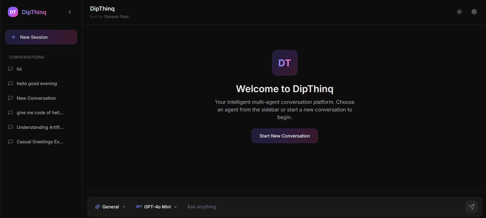

# 🚀 DipThinq

<div align="center">


**DipThinq** is a modern, premium AI conversation platform that brings together multiple AI agents and models in one beautiful interface. Built with React and Tailwind CSS, it offers a ChatGPT-like experience with advanced features like multi-agent support (Deep Thinker, Creative Writer, Code Assistant, Research Assistant), access to multiple AI models (GPT-4, DeepSeek, Gemini, Claude) through OpenRouter, and a fully responsive design with dark/light mode. The platform features AI-generated conversation titles, markdown rendering with code syntax highlighting, conversation history management, and smooth animations powered by Framer Motion. Perfect for developers, writers, researchers, and anyone who needs intelligent AI assistance with a premium user experience.

[](https://reactjs.org/)
[](https://tailwindcss.com/)
[](https://www.framer.com/motion/)

[Features](#-features) • [Demo](#-demo) • [Installation](#-installation) • [Usage](#-usage) • [Tech Stack](#-tech-stack) • [Contributing](#-contributing)

</div>

---

## ✨ Features

### 🎯 Multi-Agent System
- **Deep Thinker** - Long, structured reasoning for complex problems
- **Creative Writer** - Story-focused with tone emphasis
- **Code Assistant** - Concise and technical coding help
- **Research Assistant** - Comprehensive research and analysis

### 🤖 Multi-Model Support
Access multiple AI models through a single OpenRouter API key:
- **OpenAI** - GPT-4, GPT-3.5 Turbo
- **DeepSeek** - DeepSeek Chat
- **Google** - Gemini Pro
- **Anthropic** - Claude models

### 🎨 Premium UI/UX
- **Modern Design** - Inspired by Apple, Linear, Raycast, and Notion
- **Dark/Light Mode** - Seamless theme switching with persistent preferences
- **Glassmorphism** - Beautiful frosted glass effects and gradients
- **Smooth Animations** - Framer Motion micro-interactions
- **Fully Responsive** - Optimized for mobile, tablet, and desktop

### 💬 ChatGPT-Style Experience
- **Markdown Rendering** - Rich text formatting with syntax highlighting
- **Code Blocks** - Copy code functionality with language detection
- **Auto-Scroll** - Smooth scrolling to latest messages
- **AI-Generated Titles** - Automatic conversation title generation
- **Conversation History** - Persistent chat history in localStorage

### 🔧 Advanced Features
- **Conversation Management** - Create, delete, and manage multiple chats
- **Settings Modal** - Customize your experience
- **Safe Area Support** - Perfect mobile experience with notch support
- **Accessibility** - ARIA labels and keyboard navigation

---

## 🎬 Demo

### Application Preview


> **Note**: The image shows the full application interface with sidebar, chat area, and input bar.

---

## 🚀 Installation

### Prerequisites
- **Node.js** v14 or higher
- **npm** or **yarn**
- **OpenRouter API Key** ([Get one here](https://openrouter.ai/keys))

### Step 1: Clone the Repository
```bash
git clone https://github.com/19Dishank/dipthinq.git
cd dipthinq
```

### Step 2: Install Dependencies
```bash
npm install
```

### Step 3: Environment Setup
Create a `.env` file in the root directory:

```env
OPENROUTER_API_KEY=your_openrouter_api_key_here
```

> ⚠️ **Important**: The `.env` file is already in `.gitignore` to protect your API key.

### Step 4: Run the Application

#### Option A: Run Both Servers Together (Recommended)
```bash
npm run dev
```
This starts both the Express API server (port 3001) and React app (port 3000) simultaneously.

#### Option B: Run Servers Separately

**Terminal 1** - Start the API server:
```bash
npm run server
```

**Terminal 2** - Start the React app:
```bash
npm start
```

### Step 5: Access the Application
Open your browser and navigate to:
```
http://localhost:3000
```

---

## 📖 Usage

### Starting a Conversation
1. Click **"New Session"** in the sidebar to start a new conversation
2. Select an **agent** from the dropdown (Deep Thinker, Creative Writer, Code Assistant, or Research Assistant)
3. Choose a **model** from the model selector (GPT-4, DeepSeek, Gemini, Claude, etc.)
4. Type your message and press **Enter** or click the **Send** button

### Managing Conversations
- **View History**: All conversations are saved automatically
- **Delete Chat**: Hover over a conversation and click the trash icon
- **Delete All**: Go to Settings → Data Management → Delete All Chats

### Switching Themes
Click the **Sun/Moon** icon in the header to toggle between light and dark modes.

### Code Blocks
When AI responses contain code:
- Click **"Copy"** to copy the entire code block
- The language is automatically detected and displayed
- Syntax highlighting is applied automatically

---

## 🛠️ Tech Stack

### Frontend
- **React 19.2.0** - UI library
- **Tailwind CSS 3.4.0** - Utility-first CSS framework
- **Framer Motion 11.0.0** - Animation library
- **Lucide React** - Icon library
- **React Markdown** - Markdown rendering
- **React Syntax Highlighter** - Code syntax highlighting

### Backend
- **Express.js** - Local development server
- **OpenRouter API** - Multi-model AI access
- **Vercel Serverless Functions** - Production API endpoints

### Development Tools
- **Concurrently** - Run multiple processes
- **PostCSS** - CSS processing
- **Autoprefixer** - CSS vendor prefixing

---

## 📁 Project Structure

```
dipthinq/
├── api/
│   ├── chat.js              # Vercel serverless function
│   └── chat.local.js        # Local Express handler
├── public/
│   ├── index.html
│   └── manifest.json
├── src/
│   ├── components/
│   │   ├── ChatUI.jsx       # Main chat interface
│   │   ├── ChatMessage.jsx  # Message component
│   │   ├── InputBar.jsx     # Input with agent/model selectors
│   │   ├── Sidebar.jsx      # Conversation sidebar
│   │   └── SettingsModal.jsx # Settings modal
│   ├── contexts/
│   │   └── ThemeContext.jsx # Theme management
│   ├── agents.js            # Agent definitions
│   ├── models.js            # Model configurations
│   ├── App.js               # Root component
│   └── index.js             # Entry point
├── server.js               # Local Express server
├── package.json
└── README.md
```

---

## 🎨 Customization

### Adding New Agents
Edit `src/agents.js` to add custom agents:

```javascript
{
  id: 'agent_custom',
  name: 'Custom Agent',
  shortName: 'Custom',
  icon: 'Sparkles',
  systemPrompt: 'Your custom system prompt here...'
}
```

### Adding New Models
Edit `src/models.js` to add new AI models:

```javascript
{
  id: 'model_custom',
  name: 'Custom Model',
  provider: 'Provider Name',
  modelId: 'provider/model-name',
  description: 'Model description',
  maxTokens: 4000,
  temperature: 0.7
}
```

### Styling
All styles use Tailwind CSS. Custom styles are in `src/index.css`.

---

## 🚢 Deployment

### Vercel (Recommended)

1. Push your code to GitHub
2. Import your repository in Vercel
3. Add environment variable:
   - `OPENROUTER_API_KEY` = your API key
4. Deploy!

The `api/chat.js` file will automatically be deployed as a serverless function.

### Other Platforms
- **Netlify**: Similar to Vercel, supports serverless functions
- **Railway**: Supports Node.js applications
- **Render**: Full-stack deployment platform

---

## 🐛 Troubleshooting

### API Key Not Found
- ✅ Ensure `.env` file exists in the root directory
- ✅ Verify the file contains: `OPENROUTER_API_KEY=your_actual_key`
- ✅ Restart the server after creating/updating `.env`

### Port Already in Use
```bash
# Change React app port
PORT=3002 npm start

# Change API server port (edit server.js)
```

### Module Import Errors
- ✅ Run `npm install` to ensure all dependencies are installed
- ✅ Use Node.js v14 or higher
- ✅ Clear `node_modules` and reinstall if needed

---

## 🤝 Contributing

Contributions are welcome! Please feel free to submit a Pull Request.

1. Fork the repository
2. Create your feature branch (`git checkout -b feature/AmazingFeature`)
3. Commit your changes (`git commit -m 'Add some AmazingFeature'`)
4. Push to the branch (`git push origin feature/AmazingFeature`)
5. Open a Pull Request

---

## 📝 License

This project is licensed under the MIT License - see the [LICENSE](LICENSE) file for details.

---

## 👨‍💻 Author

**Dishank Patel**

- Built with ❤️ using React and Tailwind CSS
- Inspired by modern design systems (Apple, Linear, Raycast, Notion)

---

## 🙏 Acknowledgments

- [OpenRouter](https://openrouter.ai/) - Multi-model AI API access
- [React](https://reactjs.org/) - UI library
- [Tailwind CSS](https://tailwindcss.com/) - CSS framework
- [Framer Motion](https://www.framer.com/motion/) - Animation library
- [Lucide](https://lucide.dev/) - Icon library

---

<div align="center">

**⭐ Star this repo if you find it helpful! ⭐**

Made with ❤️ by [Dishank Patel](https://github.com/19Dishank)

</div>
